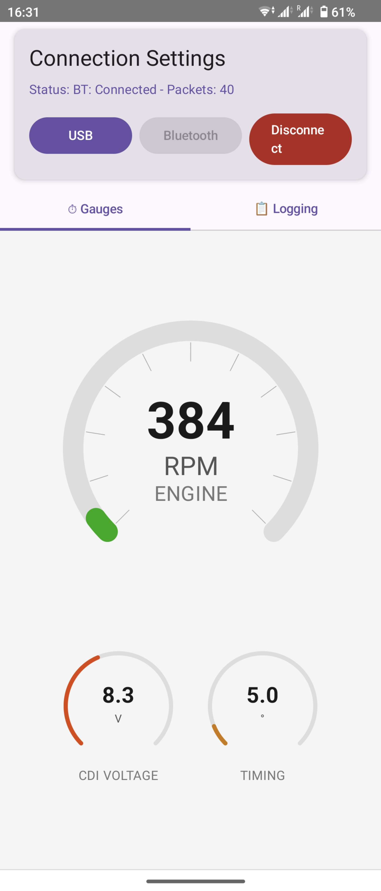
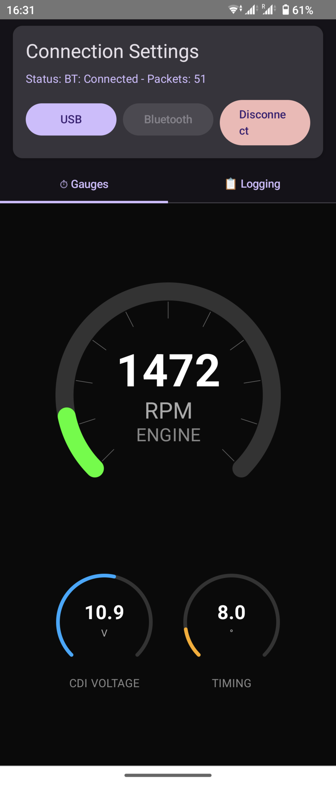

# Android application for API Tech CDI device in Honda Sonic

The idea of the application is to support displaying useful information about Coil Discharge Ignition device in the motorbike. Adjusting spark timing from within the app is also planned.

CDI is responsible for triggering a spark in the cylinder. We can tune ignition timing.

Check releases to learn more about currently supported functionality.

  
  

## Bluetooth requirements

Make sure the device is already added to Bluetooth devices. It has to be on the list of Android's known devices. It doesn't have to be connected.

## Disclaimer - AI was used to build this project

Claude Opus 4.1, 4.5 and 4.6 was used to make the project real.

## Special thanks

Thanks to [SimpleBluetoothTerminal](https://github.com/kai-morich/SimpleBluetoothTerminal) for inspiration on how to handle Bluetooth devices choice menu!
